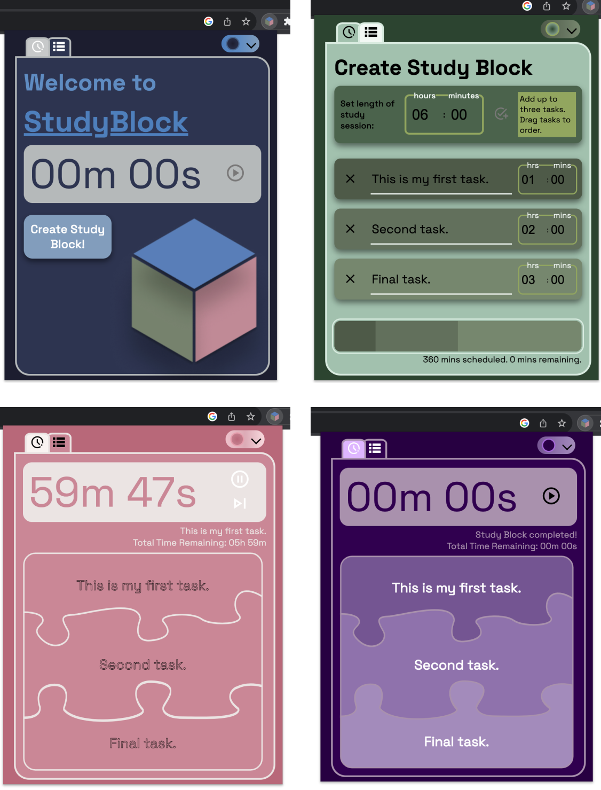

<h1 align="center">
   
  
   
  StudyBlock
   
</h1>

<h4 align="center">A productivity Chrome extension with task management and timer functionalities.</h4>

  

## Key Features

* Schedule up to three tasks with custom time intervals and descriptions
* Drag and drop tasks to reorder
* Progress bar displays time scheduled and time remaining
* Error detection for over-scheduling
* Timer shows task time and total time
* Skip tasks once completed
* Task block design changes opacity with increased progress
* Choose between four color themes

## Future Updates

* Extension service worker in development for deployment to Chrome Web Store

